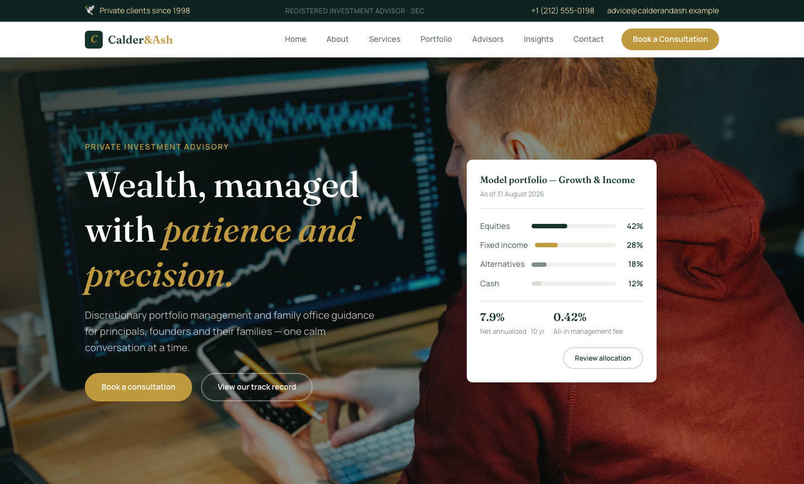

# Calder & Ash — Private Investment Advisory Template

A premium, framework-free HTML template for a boutique private investment advisory firm. Deep pine green with champagne brass accents on warm ivory grounds, driven by Fraunces serif display type and Manrope body text — an editorial, quietly confident presence for a firm that has been advising families since 1998.

## 📸 Screenshot

## Design System

| Token | Value |
|-------|-------|
| **Ground** | `--clr-ivory` `#faf8f2` (light), `--clr-dark` `#0f1a16` (dark) |
| **Primary** | `--clr-pine` `#15352c` (deep pine), `--clr-pine-mid` `#1e4a3d` |
| **Accent** | `--clr-brass` `#c09a3e` (champagne brass) |
| **Surface** | `--clr-sand` `#f2ede2`, `--clr-mist` `#eef1ec`, `--clr-line` `#d8ddd6` |
| **Text** | `--clr-ink` `#1a3a31`, `--clr-text` `#5a6d64`, `--clr-text-soft` `#7d8e85` |
| **Display type** | `Fraunces` (serif, 300–700, italic) |
| **Body type** | `Manrope` (sans, 400–800) |
| **Container** | 1200px max-width, centered |
| **Breakpoints** | ~1100px, ~992px, ~576px |

## Pages

| Page | File | Description |
|------|------|-------------|
| Home | [index.html](index.html) | Crossfading hero with overlapping allocation snapshot card, ticker strip, six strategy cards, stats band, four-step method, case grid, testimonials, insights, CTA |
| About | [about.html](about.html) | Firm story since 1998, stats band, four principles on dark pine |
| Services | [service.html](service.html) | Six practice cards, fees & transparency, four-step engagement process |
| Portfolio | [portfolio.html](portfolio.html) | Three case studies with quantified outcomes |
| Our Advisors | [team.html](team.html) | Three senior advisor cards, dark recruiting split |
| Insights | [insights.html](insights.html) | Three publications, newsletter subscribe band |
| Contact | [contact.html](contact.html) | `[data-form]` contact form, office info list, map frame |
| 404 | [404.html](404.html) | On-brand error page with recovery links |

## Features

- **Framework-free** — pure HTML5, CSS3 (custom properties, Grid, Flexbox, `clamp()`), vanilla JavaScript
- **Editorial wealth aesthetic** — pine + brass + ivory, Fraunces serif headlines with italic emphasis
- **Fluid responsive** — three breakpoints, no horizontal scroll on any viewport
- **Scroll reveal** — IntersectionObserver-powered `.reveal` animations (respects `prefers-reduced-motion`)
- **Mobile nav** — burger toggle with `aria-expanded` accessible pattern
- **Hero crossfade** — automatic 6s background image transition via `.hero-bg img` + `.active`
- **Allocation snapshot card** — overlapping hero card with animated allocation bars and track record metrics
- **Ticker strip** — discipline and fiduciary values ticker
- **Strategy cards** — six practices with icon and copy
- **Stats band** — assets, returns, team, families served
- **Method grid** — four-step numbered engagement process
- **Case grid** — quantified outcome metrics on each engagement
- **Testimonial cards** — avatar, role and client quote
- **Blog grid** — post cards with category, image and teaser
- **Contact form** — `[data-form]` hook with `.form-ok` / `.form-err` / `.show` toggle
- **Newsletter** — footer sign-up form with validation feedback
- **Original imagery** — wealth, advisory and portfolio photography, no placeholders

## Tech Stack

- HTML5 + CSS3 (W3C-valid, semantic landmarks)
- Vanilla JavaScript (canonical IIFE build)
- Google Fonts (Fraunces + Manrope)
- SVG favicon (inline data: URI)

## SEO

- Semantic HTML5 structure (`<header>`, `<nav>`, `<main>`, `<section>`, `<footer>`)
- Unique `<title>` and `<meta description>` per page
- `lang="en"` attribute, `charset="utf-8"`, viewport meta
- Alt text on all images

## License

Free for personal and commercial use. Attribution appreciated but not required.

---

## Let's Build Something Together 🚀

[Book a free consultation](https://tally.so/r/q4q1L9)
